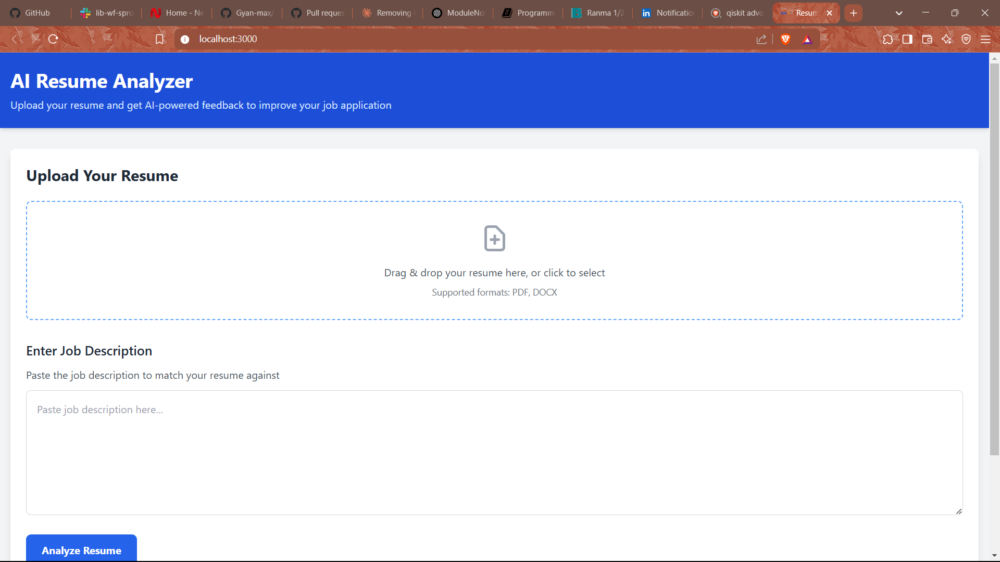

# AI-Powered Resume Analyzer 


## Table of Contents
1. [Project Overview](#project-overview)
2. [Features](#features)
3. [Tech Stack](#tech-stack)
4. [How It Works](#how-it-works)
5. [Project Structure](#project-structure)
6. [Installation and Setup](#installation-and-setup)
   - [Prerequisites](#prerequisites)
   - [Using Docker (Recommended for Production)](#using-docker-recommended-for-production)
   - [Running Locally (Without Docker)](#running-locally-without-docker)
7. [Usage](#usage)
8. [Testing](#testing)
9. [License](#license)
10. [Contributing](#contributing)
11. [Troubleshooting](#troubleshooting)

## Project Overview
The AI-Powered Resume Analyzer is a web application designed to analyze user-uploaded resumes against job descriptions, providing feedback and a job match percentage. The application consists of a frontend built with React and Tailwind CSS, and a backend developed using Flask.

## Features
- Resume Upload (PDF/Docx Support)
- Extract Skills & Experience using NLP
- Match Resume with a Job Description
- Provide Score & Suggestions
- Download Improved Resume Suggestions

## Tech Stack
### Frontend
- **React.js**: JavaScript library for building user interfaces.
- **Tailwind CSS**: Utility-first CSS framework for styling.
- **Axios**: Promise-based HTTP client for making API requests.

### Backend
- **Flask**: Micro web framework for Python.
- **Flask-CORS**: Extension for handling Cross-Origin Resource Sharing (CORS).
- **PyMuPDF**: Library for PDF text extraction.
- **python-docx**: Library for reading and writing Microsoft Word files.
- **NLTK**: Natural Language Toolkit for text processing.
- **OpenAI API**: For analyzing resumes and providing feedback.

### ML Processing
- OpenAI API for text analysis.
- NLTK or spaCy for text processing.

## How It Works
1. User uploads a resume (PDF or Docx).
2. The backend extracts text using Python's PyMuPDF or python-docx.
3. The Machine Learning model (or OpenAI API) analyzes skills, keywords, and experience.
4. Compares the resume with a job description provided by the user.
5. Generates feedback (e.g., missing skills, keyword optimization).
6. Displays job match score and lets users download an improved version.

## Project Structure
```
ResumeAnalyzer/
├── frontend/        # React.js application
│   ├── src/         # React source code
│   ├── public/      # Static files
│   └── Dockerfile   # Frontend Docker configuration
├── backend/         # Flask API server
│   ├── app.py       # Main Flask application
│   ├── requirements.txt # Python dependencies
│   └── Dockerfile   # Backend Docker configuration
├── docker-compose.yml  # Docker Compose configuration
└── README.md        # Project documentation
```

## Installation and Setup
### Prerequisites
- Node.js (v14 or later)
- Python (v3.8 or later)
- OpenAI API Key
- Docker and Docker Compose (optional, for containerized setup)

### Using Docker (Recommended for Production)
1. Create a `.env` file in the project root with your OpenAI API key:
   ```
   OPENAI_API_KEY=your_actual_openai_api_key
   FLASK_ENV=production
   ```

2. Build and start the containers:
   ```
   docker-compose up -d
   ```

3. Access the application at `http://localhost`.

### Running Locally (Without Docker)
**Backend Setup**
1. Navigate to the backend directory:
   ```
   cd ResumeAnalyzer/backend
   ```

2. Create a virtual environment:
   ```
   python -m venv venv
   ```

3. Activate the virtual environment:
   - Windows:
     ```
     venv\Scripts\activate
     ```
   - MacOS/Linux:
     ```
     source venv/bin/activate
     ```

4. Install required packages:
   ```
   pip install -r requirements.txt
   ```

5. Create a `.env` file in the backend directory:
   ```
   cp .env.example .env
   ```

6. Add your OpenAI API key to the `.env` file:
   ```
   OPENAI_API_KEY=your_actual_openai_api_key
   ```

7. Run the Flask development server:
   ```
   python app.py
   ```
   The backend will be available at `http://localhost:5000`.

**Frontend Setup**
1. Navigate to the frontend directory:
   ```
   cd ResumeAnalyzer/frontend
   ```

2. Install required packages:
   ```
   npm install
   ```

3. Start the development server:
   ```
   npm start
   ```
   The frontend will be available at `http://localhost:3000`.

## Usage
1. Upload your resume (PDF or DOCX format).
2. Paste the job description you want to match against.
3. Click "Analyze Resume".
4. Review the analysis results including:
   - Job match score
   - Skills found in your resume
   - Missing skills from the job description
   - Suggestions for improvement

## Testing
To run the backend tests, navigate to the backend directory and run:
```bash
python -m unittest test_app.py
```

## License
This project is open source and available under the MIT License.

## Contributing
Contributions are welcome! Please feel free to submit a pull request or open an issue for any suggestions or improvements.

## Troubleshooting
- If you encounter CORS issues, make sure both frontend and backend are running.
- For OpenAI API errors, verify your API key is correct and has sufficient credits.
- If Docker containers fail to start, check port availability and environment variables.
